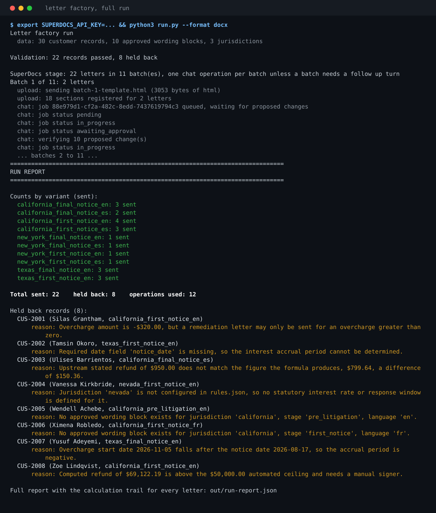

# Letter factory for collections and remediation

I built this for an operations team that has to send legally worded letters at volume: refund notices, overcharge remediation, collections stages. The wording is fixed by legal and varies by jurisdiction, by stage and by language, and each letter has to carry that customer's own figures. This service picks the right approved wording block, inserts figures that come from a formula rather than from a model, pushes the letter through SuperDocs, and refuses to send anything whose numbers do not survive a sanity check.

The one rule the whole design is built around: **approved wording is never rewritten**. The AI is allowed to apply a targeted edit, and then I compare what it produced against the approved block character for character. If a single word moved, the change is denied and the record is held.

## What a run does

On the last full run: 30 customer records in, 22 letters produced across 10 variants, 8 records held back, 12 SuperDocs operations used.

```
Counts by variant (sent):
  california_final_notice_en: 3 sent
  california_final_notice_es: 2 sent
  california_first_notice_en: 4 sent
  california_first_notice_es: 3 sent
  new_york_final_notice_en: 1 sent
  new_york_final_notice_es: 1 sent
  new_york_first_notice_en: 1 sent
  new_york_first_notice_es: 1 sent
  texas_final_notice_en: 3 sent
  texas_first_notice_en: 3 sent

Total sent: 22    held back: 8    operations used: 12

Held back records (8):
  CUS-2001 (Silas Grantham, california_first_notice_en)
      reason: Overcharge amount is -$320.00, but a remediation letter may only be sent for an overcharge greater than zero.
  CUS-2002 (Tamsin Okoro, texas_first_notice_en)
      reason: Required date field 'notice_date' is missing, so the interest accrual period cannot be determined.
  CUS-2003 (Ulises Barrientos, california_final_notice_es)
      reason: Upstream stated refund of $950.00 does not match the figure the formula produces, $799.64, a difference of $150.36.
  CUS-2004 (Vanessa Kirkbride, nevada_first_notice_en)
      reason: Jurisdiction 'nevada' is not configured in rules.json, so no statutory interest rate or response window is defined for it.
  CUS-2005 (Wendell Achebe, california_pre_litigation_en)
      reason: No approved wording block exists for jurisdiction 'california', stage 'pre_litigation', language 'en'.
  CUS-2006 (Ximena Robledo, california_first_notice_fr)
      reason: No approved wording block exists for jurisdiction 'california', stage 'first_notice', language 'fr'.
  CUS-2007 (Yusuf Adeyemi, texas_final_notice_en)
      reason: Overcharge start date 2026-11-05 falls after the notice date 2026-08-17, so the accrual period is negative.
  CUS-2008 (Zoe Lindqvist, california_first_notice_en)
      reason: Computed refund of $69,122.19 is above the $50,000.00 automated ceiling and needs a manual signer.
```

Here is the same run as a screenshot, held records and all:



The full captured output is in [`sample-output/run-output.txt`](sample-output/run-output.txt), real letters SuperDocs produced are in [`sample-output/`](sample-output/), and [`sample-output/run-report.json`](sample-output/run-report.json) carries the step by step arithmetic for all 22.

## What the data covers, and how to add more without touching code

| Jurisdiction | Stages | Languages |
|---|---|---|
| California | first notice, final notice | English, Spanish |
| Texas | first notice, final notice | English |
| New York | first notice, final notice | English, Spanish |

Ten approved wording blocks in total. To add a jurisdiction, a stage or a language:

1. Add the jurisdiction to `jurisdictions` in `data/rules.json` (its statutory rate, day basis, response window and regulator name). Skip this if you are only adding a stage or language to a jurisdiction that already exists.
2. Add one wording block per stage and language to `data/wording_blocks.json`, using `{{placeholder}}` tokens for anything customer specific.
3. Add customer records that reference it in `data/customers.json`.

No Python changes. I proved this to myself rather than assuming it: I built and tested the whole pipeline on California and Texas, committed, and then added New York in a commit that touches only those three JSON files. The git history shows it.

## Running it

Python 3.9 or newer. No dependencies, standard library only.

```bash
export SUPERDOCS_API_KEY=your-key-here

python3 run.py                  # full run, every record
python3 run.py --sample 3       # small sample mode, first three records only
python3 run.py --offline        # validate and assemble locally, no API calls, no operations spent
python3 run.py --format pdf     # export pdf instead of docx
python3 test_engine.py          # 448 assertions over the figures, checks and assembly, no API key needed
```

Start with `--offline` and `--sample`. Offline mode runs the whole validation and assembly path and writes every letter locally without spending a single operation, which is how I did most of my testing.

Outputs land in `out/`: one HTML letter per customer in `out/letters/`, one exported file per batch, and `out/run-report.json` with the calculation trail for every letter.

## How a figure gets into a letter

Every number is produced by the formula in `data/rules.json`, step by step, in integer cents using `Decimal`. No model is ever asked for a figure. The run report keeps the working, so any number in any letter can be checked by hand:

```
overcharge_cents = 42500 cents, taken from record field 'overcharge_cents' (overcharge on file)
accrual_days = 214 (2026-01-15 to 2026-08-17, days of accrual)
annual_rate_bps = 1000, from jurisdiction 'california' (statutory annual rate in basis points)
day_basis = 365, from jurisdiction 'california' (day count basis)
interest_cents = overcharge_cents * annual_rate_bps / 10000 * accrual_days / day_basis
               = 42500 * 1000 / 10000 * 214 / 365 = 2492 cents (simple interest)
refund_cents = overcharge_cents + interest_cents = 42500 + 2492 = 44992 cents (total refund due)
```

## The sanity checks

The checks live in `data/rules.json`, not in the code. Each one carries its own reason template, so a held record always says what is actually wrong with it rather than "failed validation". Checks that need a figure run after the arithmetic; the rest run before it, so a record with a missing date is held instead of crashing the formula.

| Check | What it catches |
|---|---|
| `jurisdiction_known` | A jurisdiction with no rate, day basis or response window configured |
| `notice_date_present` | A missing notice date, which would make the accrual period unknowable |
| `overcharge_start_date_present` | A missing overcharge start date, same reason |
| `account_number_present` | A missing account number, which every letter has to quote |
| `overcharge_positive` | A negative or zero overcharge |
| `accrual_period_not_reversed` | An overcharge start date that falls after the notice date |
| `stated_refund_matches_formula` | An upstream refund figure that disagrees with the formula, reported with the difference |
| `refund_within_manual_review_ceiling` | A refund large enough to need a human signer |
| `wording_block_exists` | A jurisdiction, stage or language combination with no approved wording |

There is a tenth gate that is not in the data file, because it is about the AI rather than about the record: after SuperDocs proposes an edit, the proposed text is compared against the approved block with the figures inserted. Only an exact match is approved. Anything else is denied and the record is held quoting both the expected and the received text.

That gate has already earned its place. On an earlier version I let the editor work from a token to value map, and on longer letters it invented figures, invented an interest rate and invented a regulator name ("Financial Conduct Authority", which appears nowhere in my data). Every one of those was denied and no customer letter was affected. I then changed the instruction to state the exact text each section must end up reading, which removed the room to invent, and the next full run came back with zero denials. Both the failure and the fix are written up in [PROGRESS.md](PROGRESS.md).

## Which SuperDocs features it uses

The four calls, in order, per batch:

1. **Upload** (`POST /v1/documents/upload`) puts the batch template, approved wording with placeholder tokens still in it, into a session as the active document.
2. **Chat** (`POST /v1/chat/async` with `approval_mode: ask_every_time`) asks for the targeted section edits that insert the customer figures. Nothing is applied yet, only proposed.
3. **Approve** (`POST /v1/chat/{session_id}/approve`) accepts each proposed change, one at a time, and only after it has matched the approved wording exactly. Mismatches are denied through the same call.
4. **Export** (`POST /v1/documents/export`) writes the finished batch out as DOCX, PDF, HTML, Markdown or TXT. Exports cost no operations, so a run exports every batch.

Batches are packed against the 25 sections per operation limit, which works out at two letters per batch here, and no customer goes through the pipeline twice in a run.

## Files

```
data/rules.json            jurisdictions, the formula, the checks, money and date formats
data/wording_blocks.json   the approved wording, the only place letter text exists
data/customers.json        30 fictional customer records, 8 of them deliberately broken
engine.py                  figures, checks, wording block selection, assembly. No network, no model
superdocs.py               the four API calls and the job poller
run.py                     batching, the approve loop with verification, the run report
ai_review.py               optional advisory second opinion from a Haiku class model, off by default
test_engine.py             tests for everything deterministic, no API key required
```

## Credit

I built this for the SuperDocs engineering task. Sundaram Kumar Jha, GitHub [@sundaram2021](https://github.com/sundaram2021).
